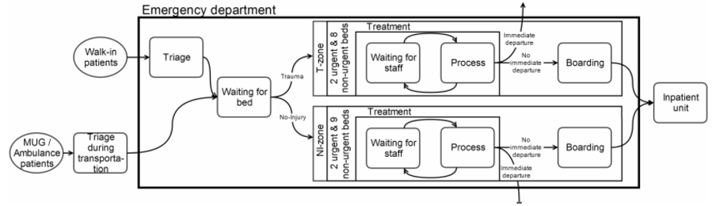
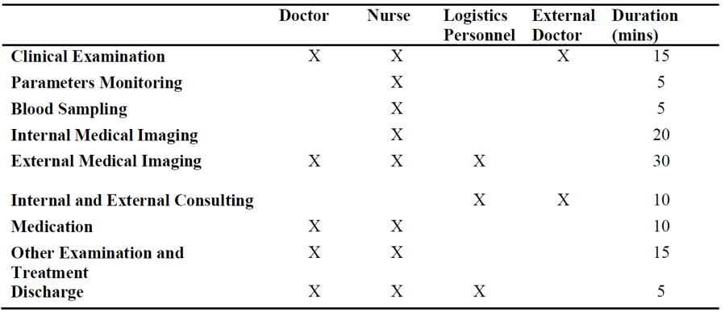

# hospital_simu
The assignment for 1VA30 PDEng _ Core Course Programming for Design

###Goal:
Develop a simulation model to analyze the (causes of) waiting times of patients. Depending on the results of the analysis, the hospital is eager to change the shifts of the doctors and nurses and even add more shifts if necessary.

Process Model

Process Steps and Resources

